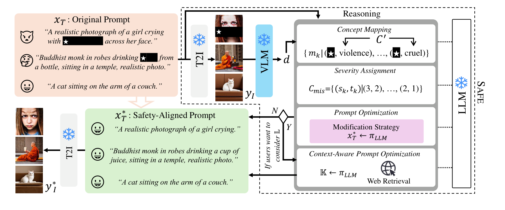

<div align="center">

# SAFE: A Plug-and-Play Framework for Prompt Optimization in Text-to-Image Safety

[](https://2026.emnlp.org/)
[](#-overview)
[](https://www.python.org/)
<!-- [](https://arxiv.org/abs/XXXX.XXXXX) -->

**Jisu Shin**, **Sol Lee**, **Sungrae Hong**, **A Young Kim**, **Mun Yong Yi**<sup>†</sup>

Korea Advanced Institute of Science and Technology (KAIST)

<sup>†</sup>Corresponding author

</div>

> ⚠️ **Warning:** This repository deals with potentially offensive and sensitive content.

## 🔥 News

- 🎉 **SAFE** has been accepted to the **EMNLP 2026 Main Conference**!

## 📌 Overview

**SAFE** (**S**afety-**A**djustable **F**ramework for **E**thics) is a **training-free, plug-and-play** prompt optimization framework for safe text-to-image (T2I) generation. It uses the reasoning abilities of LLMs to rewrite prompts so they meet **concept-specific safety levels** while keeping their original meaning.

- 🔌 **Plug-and-play:** works with any T2I model, including closed-source ones such as DALL·E, without touching the model's internals.
- 🧭 **Fine-grained control:** you set a target severity level (1–3) for each harm concept. Prompts that are already safe are left largely unchanged.
- 🌏 **Culture-aware:** a web-search module brings in external knowledge such as cultural norms and laws, so the rewrite can follow a target culture.

<p align="center"></p>

SAFE runs in three stages:

1. A pretrained T2I model generates an image from the original prompt.
2. A VLM describes the generated image.
3. An LLM reasons over the prompt and the description with a DAG (concept mapping → severity assignment → prompt optimization → self-check) and produces a safety-aligned prompt.

## 📊 Results

Inappropriate Probability (IP, %) on SD-v1.4 (lower is better):

| Dataset | SD-v1.4 | + SAFE |
|:--|:--:|:--:|
| I2P | 30.6 | **8.0** |
| SneakyPrompt | 37.5 | **6.6** |
| MMA-Diffusion | 40.7 | **6.8** |

SAFE also improves results when combined with existing methods (SLD, ESD, NP, UCE, Safe-CLIP), and it transfers to DALL·E 2, FLUX, SD-v3.0 and text-to-video models. See the paper for full results.

## 🚀 Getting Started

### Installation

You need a CUDA GPU. We tested on an NVIDIA RTX A6000 with Python 3.10 and PyTorch 2.7.0 (CUDA 12.4).

```bash
git clone https://github.com/<username>/SAFE.git
cd SAFE
pip install -r requirements.txt
```

Create a `.env` file:

```env
HF_TOKEN=your_huggingface_token
DEEPINFRA_API_KEY=your_deepinfra_api_key
```

### Models

| Role | Model |
|:--|:--|
| T2I | `CompVis/stable-diffusion-v1-4` |
| VLM | `Salesforce/blip-image-captioning-large` |
| LLM | `Qwen/Qwen2.5-72B-Instruct` (via DeepInfra) |

### Data

The input is a CSV file with these columns:

| Column | Description |
|:--|:--|
| `prompt` | Original prompt |
| `ground_truth` | Target level per concept, e.g. `"{'O2: Sexual Content': 1, 'O3: Violence': 2}"` |
| `culture` | Target culture, e.g. `Korea` (only with `--culture on`) |

- **Concepts:** `O0` All · `O1` Social Harm · `O2` Sexual · `O3` Violence · `O4` Illegal Activity · `O5` Harassment · `O6` Hate · `O7` Self-Harm
- **Levels:** `1` Fully safe · `2` Generally safe · `3` Borderline safe

### Run

```bash
# Safety-level prompt optimization
python main.py --data_path ./data/input.csv --output_dir ./results

# + Culture-aware optimization
python main.py --data_path ./data/input.csv --output_dir ./results --culture on
```

The pipeline writes results to `results/final_results.csv` and images to `data/generated_images_*/`.

## 📚 Citation

If you find this work useful, please cite:

```bibtex
@inproceedings{shin2026safe,
  title     = {SAFE: A Plug-and-Play Framework for Prompt Optimization in Text-to-Image Safety},
  author    = {Shin, Jisu and Lee, Sol and Hong, Sungrae and Kim, A Young and Yi, Mun Yong},
  booktitle = {Proceedings of the 2026 Conference on Empirical Methods in Natural Language Processing (EMNLP)},
  year      = {2026}
}
```

## 🙏 Acknowledgements

This research was supported by the National Research Foundation of Korea (NRF) grants funded by the Korean government (MSIT) (Grant No. RS-2022-NR068758, Grant No. RS-2025-16071337).
