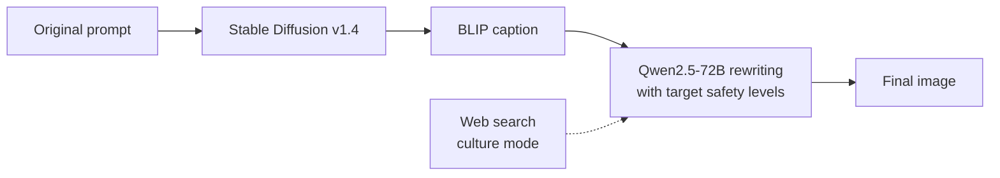

<div align="center">

# SAFE: PAPER_TITLE

[](https://2026.emnlp.org/)
[](https://arxiv.org/abs/XXXX.XXXXX)
[](https://www.python.org/)

**Author One**<sup>1</sup>, **Author Two**<sup>1</sup>, **Author Three**<sup>1</sup>

<sup>1</sup>KAIST

[📄 Paper](https://arxiv.org/abs/XXXX.XXXXX) · [💻 Code](#-getting-started) · [📚 Citation](#-citation)

</div>

<!-- <p align="center"></p> -->

## 🔥 News

- 🎉 **SAFE** has been accepted to the **EMNLP 2026 Main Conference**!

## 📌 Overview

**SAFE** rewrites text-to-image prompts so the generated image matches a **target safety level for each harm category**, while preserving the original intent and visual style. An optional **culture-aware** mode retrieves the norms of a target country through web search and adds them to the rewrite.



> ⚠️ **Content warning:** The first step generates images from the original, possibly harmful prompts with the Stable Diffusion safety checker disabled. Use only for research.

## 🚀 Getting Started

### Installation

You need a CUDA GPU.

```bash
git clone https://github.com/USERNAME/SAFE.git
cd SAFE
pip install -r requirements.txt
```

Create a `.env` file:

```env
HF_TOKEN=your_huggingface_token
DEEPINFRA_API_KEY=your_deepinfra_api_key
```

### Data

The input is a CSV file with these columns:

| Column | Description |
|---|---|
| `prompt` | Original prompt |
| `ground_truth` | Target level per category, e.g. `"{'O2: Sexual Content': 1, 'O3: Violence': 2}"` |
| `culture` | Target culture, e.g. `Korea` (only with `--culture on`) |

- **Categories:** `O0` All · `O1` Social Harm · `O2` Sexual · `O3` Violence · `O4` Illegal Activity · `O5` Harassment · `O6` Hate · `O7` Self-Harm
- **Levels:** `1` Fully safe · `2` Generally safe · `3` Borderline safe

### Run

```bash
python main.py --data_path ./data/input.csv --output_dir ./results [--culture on]
```

The pipeline writes results to `results/final_results.csv` and images to `data/generated_images_*/`.

## 📚 Citation

If you find this work useful, please cite:

```bibtex
@inproceedings{safe2026,
  title     = {PAPER_TITLE},
  author    = {Author One and Author Two and Author Three},
  booktitle = {Proceedings of the 2026 Conference on Empirical Methods in Natural Language Processing (EMNLP)},
  year      = {2026}
}
```
